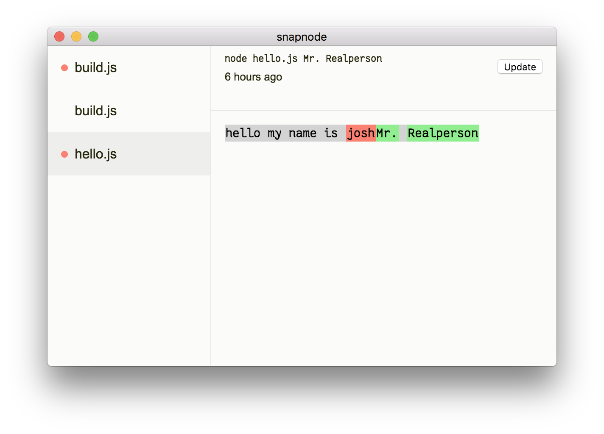

# snapnode

_run your node in snapshot mode!_



## Usage

- first, install: `npm install -g snapnode`
  - also `npm install -g electron` if you don't have it already
- now instead of running `node yourscript.js` run `snapnode yourscript.js`
- you'll see the output of `yourscript.js` in a window
- try changing something in `yourscript.js` to produce a different output.
- now you can see the diff!
- if the new output looks wrong, fix it. If it looks right, press the "Update" button to update the base snapshot.

### Power user

- `j` and `k` move to the next and previous snapshot in the list.

- when there is a diff you can press the `\` (or `|`)  key to toggle between a unified diff and a split left/right view.

### Multiple snapshots

You can create a config file with multiple snapshots. Whenever you edit a js file in your project, all snapshots will be recalculated so you can see which diffs changed.

For example, create a file called `snaps.js` in your project root:

```js
module.exports = {
  entries: [
    {
      file: 'place-order.js',
      args: [ ]
    },

    {
      file: 'place-order.js',
      args: [ 'pizza', '--cheese' ]
    },

    {
      file: 'hello.js',
      args: [ 'Mr. Realperson' ]
    }
  ]
}
```

Then run `snapnode snaps.js`

## License

MIT
